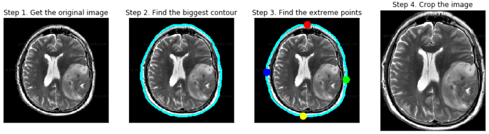

---
jupyter:
  jupytext:
    formats: ipynb,md
    text_representation:
      extension: .md
      format_name: markdown
      format_version: '1.3'
      jupytext_version: 1.14.0
  kernelspec:
    display_name: Python 3 (ipykernel)
    language: python
    name: python3
---

<!-- #region -->
## Расспознование изображений рака на МРТ снимках головного мозга

Искомая задача состоит в следующем: пусть есть единичное изображение МРТ мозга, программа должна сказать есть ли на этом фото рак. Более формально на каждое фото программа должна выдать вероятность присутствия рака. Это задача относится к классу задач, называемых задачи бинарной классификации. 

В машинном обучении для решения задач бинарной классификации используются различные методы, такие например как деревья решений или логистическая регрессия. Так как наши входные данные это изображения это сильно сужает возможность произвольного выбора метода. То есть, лучше всего будет использовать методы наиболее хорошо работающие с изображениями, такие например как метод Виолы - Джонса, Метод направленных градиентов, свёрточные нейронные сети.


Для начала нужно получить данные загрузить их и сделать предобработку.

Предварительно загрузили датасет с сайта kaggle и поместили его в папку Data нашего проекта.

https://www.kaggle.com/datasets/navoneel/brain-mri-images-for-brain-tumor-detection
<!-- #endregion -->

```python
import pandas as pd
import os
import numpy as np
import seaborn as sns
import matplotlib.pyplot as plt
import cv2
import imutils
import torch 
from torch.utils.data import TensorDataset, DataLoader
from torchsummary import summary
import torchvision.models as models
import torchvision
import PIL
from sklearn.model_selection import train_test_split
from sklearn.preprocessing import StandardScaler
from sklearn.metrics import accuracy_score

sns.set(rc={'figure.figsize':(8, 8)})
```

Для начала можно можно загрузить единичное изображение и посмотреть как это выглядит.

```python
A = cv2.imread('Data/yes/Y1.jpg')
```

```python
sns.heatmap(A[:,:,0], cmap='bone')
```

Так как данные мы загрузили локально на диск и их колличество их небольшое мы можем смело их сразу все загрузить в оперативную память для работы с ними

```python
df = []
labels = []
```

Следующие циклы загружают все фотографии из папки. Помимо этого некоторые фотографии имеют три канала цветов, несмотря на то что они монохромные. В таких фотографиях мы оставляем только один произвольные канал, какой именно - не важно так как мотографии монохромные и все три канала одинаковы.

```python
for path in os.listdir("Data/yes"):

    temp = cv2.imread('Data/yes/'+path)
    if len(temp.shape) == 3:
        temp = temp[:,:,0]
    df.append(temp)
    labels.append(1)

for path in os.listdir("Data/no"):

    temp = cv2.imread('Data/no/'+path)
    
    if len(temp.shape) == 3:
        temp = temp[:,:,0]
    df.append(temp)
    labels.append(0)


```

функция для отрисовки большого колличества изображений:

```python
def show_image(df, n, k):
    plt.figure(figsize=(n*10, k*10))
    for i in range(n*k):
        plt.subplot(k, n, i+1)
        plt.axis("off")
        if (len(df[i].shape) == 3):
            plt.imshow(df[i][0,:,:], cmap="bone")
        else:
            plt.imshow(df[i], cmap="bone")
    plt.show()
```

```python
show_image(df, 10, 3)
```

Тут сразу видно две проблеммы, которые могут помешать алгоритму выдать хороший результат. Во первых фотографии все разного размера, во вторый некоторые изображения имеют большую чёрную часть по краям. Небходимо обрезать все фотографии до краёв изображения мозга. Делать это будем используя библиотеки OpenCV и imutils. Подробнее про алгоритом можно прочитать в следующей статье:


https://pyimagesearch.com/2016/04/11/finding-extreme-points-in-contours-with-opencv/


```python
def crop_imgs(set_name, add_pixels_value=0):
    """
    Finds the extreme points on the image and crops the rectangular out of them
    """
    set_new = []
    for img in set_name:
        #gray = cv2.cvtColor(img, cv2.COLOR_RGB2GRAY)
        #gray = cv2.GaussianBlur(gray, (5, 5), 0)
        gray = cv2.GaussianBlur(img, (5, 5), 0)
        
        # threshold the image, then perform a series of erosions +
        # dilations to remove any small regions of noise
        thresh = cv2.threshold(gray, 45, 255, cv2.THRESH_BINARY)[1]
        thresh = cv2.erode(thresh, None, iterations=2)
        thresh = cv2.dilate(thresh, None, iterations=2)

        # find contours in thresholded image, then grab the largest one
        cnts = cv2.findContours(thresh.copy(), cv2.RETR_EXTERNAL, cv2.CHAIN_APPROX_SIMPLE)
        cnts = imutils.grab_contours(cnts)
        c = max(cnts, key=cv2.contourArea)

        # find the extreme points
        extLeft = tuple(c[c[:, :, 0].argmin()][0])
        extRight = tuple(c[c[:, :, 0].argmax()][0])
        extTop = tuple(c[c[:, :, 1].argmin()][0])
        extBot = tuple(c[c[:, :, 1].argmax()][0])

        ADD_PIXELS = add_pixels_value
        new_img = img[extTop[1]-ADD_PIXELS:extBot[1]+ADD_PIXELS, extLeft[0]-ADD_PIXELS:extRight[0]+ADD_PIXELS].copy()
        set_new.append(new_img)

    return set_new
```

```python
df = crop_imgs(df)
```

```python
show_image(df, 10, 3)
```

Видно что стало лучше, изображения больше похожи друг на друга.

Далее необходимо прибегнуть к особой технике, а именно Data Augmentation. Это способ увеличить размер тренирующей выборки при помощи небольшого видоизменения исходных данных. Необходимо это из за того, что наш датасет очень маленький. Это кстати типичная проблема если решается задача из области медицины.

Да изображений такими изменениями может быть зеркалирование, поворот, сдвиг, обрезка, изменение цвета, аффинное преобразование и т.д.

Мы будем использовать библиотеку PyTorch для нейросетей, она же предоставляет функционал для Data Augmentation.

Более подробно об этом можно прочитать в следующей статье:


https://pytorch.org/vision/stable/auto_examples/plot_transforms.html#sphx-glr-auto-examples-plot-transforms-py

```python
transforms = torchvision.transforms.Compose([
    # Это композиция преобразований, изображение проходит через каждое по порядку
    torchvision.transforms.ToTensor(),
    torchvision.transforms.Resize((230,230),interpolation=torchvision.transforms.InterpolationMode.BICUBIC),
    torchvision.transforms.CenterCrop((224, 224)), # Обрезка озображения
    torchvision.transforms.RandomHorizontalFlip(0.5), # зеркалирование изображения по горизонтали с вероятностью 0.5
                                                      # Особенно актуально для симметричного мозга
    torchvision.transforms.RandomAffine(7, (0.03,0.03), (0.93, 1), (-3,3,-3,3), 
                                        interpolation=torchvision.transforms.InterpolationMode.BILINEAR),
    # Случайное Афинное преобразование: 
    # Повернуть в случайную сторону не более чем на 7 градусов
    # сместить по вертикали и горизонтали не более чем на 3 %
    # Уменьшить на не более чем в 0.93 раз
    # Сдвинуть изображение не более чем на 3 по каждой из осей
    torchvision.transforms.Normalize([0],[1])
])
```

Посмотрим какие преобразования получаются:

```python
n = 8
k = 5

plt.figure(figsize=(n*10, k*10))
for i in range(n * k):
    plt.subplot(k, n, i+1)
    plt.axis("off")
    plt.imshow(transforms(df[i//n]).numpy().reshape((224, 224)), cmap="bone")
    
plt.show()
```

Так как изображения всё равно очень похожи друг на друга, необходимо не допустить того, что бы разные варианты одного изображения оказались одновременно и в тренировочной и тестовой выборке. Поэтому для начала разделим датасет на тренировочную и тестовую выборку.

```python
type(df[0])
```

```python
train_dsX, test_dsX, train_dsy, test_dsy = train_test_split(df, labels, stratify=labels, test_size=0.20)
```

Теперь мы можем увеличит наш датасет, колличество копий исходных изображений я взял 5. Это немного, так сделанно потому что получаемые изображения всё равно сильно похожи друга на друга.

```python
k = 10  #Сколько копий одного изображения будем делать
train_X = []
train_y = []

for i in range(len(train_dsX)):
    for j in range(k):
        temp = transforms(train_dsX[i]).numpy()[0,:,:]
        temp = np.stack((temp, temp, temp))
        train_X.append(temp)
        train_y.append(train_dsy[i])
train_X = np.array(train_X)
train_y = np.array(train_y, dtype='int')

#k = 1
test_X = []
test_y = []

for i in range(len(test_dsX)):
    for j in range(k):
        temp = transforms(test_dsX[i]).numpy()[0,:,:]
        temp = np.stack((temp, temp, temp))
        test_X.append(temp)
        test_y.append(test_dsy[i])
test_X = np.array(test_X)
test_y = np.array(test_y, dtype='int')
```

Теперь необходимо провести нормализацию для того что бы алгоритмы лучше работали.
Так как torchvision.transforms.Normalize заставить работать не удалось, будем использовать sklearn
и его StandardScaler

```python
scalar = StandardScaler()
scalar.fit(np.vstack((train_X, test_X)).reshape(-1, 3*224*224))
train_X = scalar.transform(train_X.reshape(-1, 3*224*224))
test_X = scalar.transform(test_X.reshape(-1, 3*224*224))

train_X = train_X.reshape(-1, 3, 224, 224)
test_X = test_X.reshape(-1, 3, 224, 224)
```

```python
print(train_X.shape)
print(train_y.shape)
print(test_X.shape)
print(test_y.shape)
```

```python
show_image(train_X, 8, 5)
```

Теперь перейдём к основной части, необходимо создать алгоритм распознающий целевые изображения. Мы будем использовать свёрточную нейроную сеть, так как начиная с того момента как в 2012 году AlexNet победил на конкурсе ImageNet, нейронные сети теперь это самые эффективные модели компьютерного зрения.

Так же будем использовать технику под названием Transfer Leanring. Это техника которая позволяет существенно сократить затраты и время создания модели. Суть в том что мы возьмём уже обученную ранее сеть для другой задачи, далее немного видоизменим её и дообучим.

Мы возьмём сеть ResNet18 которая создавалась для конкурса ImageNet, заменим у неё последний слой, остальные слои заморозим что бы они не менялись и обучим только последний слой.

```python
device = torch.device("cuda" if torch.cuda.is_available() else "cpu")
device
```

Для загрузки сети используем torchvision

```python
model = models.resnet18(weights=torchvision.models.ResNet18_Weights.IMAGENET1K_V1)
```

Теперь можем посмотреть структуру сети

```python
model
```

А так же можем посмотреть колличество обучаемых параметров

```python
summary(model.cuda(), (3, 224, 224))
```

Видно что модель имеет более 11 миллионов обучаемых параметров, если мы будем их все обучать модель неизбежно переобучится, кроме того обучаться это будет очень долго. Поэтому для начала заморозим обучение всех существующих слоёв:

```python
for param in model.parameters():
    param.requires_grad = False

```

Теперь заменим последний слой, на два слоя, так что бы выходных нейронов было всего 2

```python
model.fc = torch.nn.Sequential(
torch.nn.Dropout(p=0.5),
torch.nn.Linear(512, 128),
torch.nn.ReLU(inplace=True),
torch.nn.Dropout(p=0.5),
torch.nn.Linear(128, 2))
```

```python
model = model.to(device)
```

Посмотрим на колличество обучаемых параметров:

```python
summary(model, (3, 224, 224))
```

Теперь параметров значительно меньше.

Теперь зададим параметры обучения, а именно перекрёстную энтропию как функция потерь. И Adam алгоритм как оптимизатор.

```python
criterion = torch.nn.CrossEntropyLoss()
optimizer = torch.optim.Adam(model.parameters(), lr = 0.00005)
```

Для работы в pytorch есть удобное решение "под ключ" для подачи данных во время обучения, это особый класс DataLoader очень удобный в использовании.

```python
train_dataset = TensorDataset(torch.Tensor(train_X), torch.Tensor(train_y))
test_dataset = TensorDataset(torch.Tensor(test_X), torch.Tensor(test_y))

bt = 2
train_dataloader = DataLoader(train_dataset, batch_size = bt, shuffle=True)
test_dataloader = DataLoader(test_dataset, batch_size = bt, shuffle=True)

loaders = {"train": train_dataloader, "test": test_dataloader}
```

```python
accuracy = {"train": [], "test": []}
```

Далее следует основной цикл обучения, этот блок кода можно запускать несколько раз для полного дообучения модели

```python
max_epochs = 30
for epoch in range(max_epochs):
    for k, dataloader in loaders.items():
        epoch_correct = 0
        epoch_all = 0
        for x_batch, y_batch in dataloader:
            x_batch = x_batch.to(device)
            y_batch = y_batch.to(device)
            if k == "train":
                model.train()  # <------------------ переводим модель в режим train
                optimizer.zero_grad()  # <--------- обнуляем градиенты модели
                #print(x_batch)
                outp = model(x_batch)
            else:
                model.eval()  # <------------------ переводим модель в режим eval
                with torch.no_grad():  # <--------- НЕ считаем градиенты
                    outp = model(x_batch)  # <------------- получаем "логиты" из модели
            preds = outp.argmax(-1)
            correct = (preds == y_batch).type(torch.long).sum()
            all = bt
            epoch_correct += correct.item()
            epoch_all += all
            if k == "train":
                y_batch=y_batch.to(torch.int64)
                loss = criterion(outp, y_batch) 
                loss.backward() # <--------------- считаем градиенты
                optimizer.step()  # <-------------- делаем шаг градиентного спуска
            
        if k == "train":
            print(f"Epoch: {epoch+1}")
        print(f"Loader: {k}. Accuracy: {epoch_correct/epoch_all}")
        accuracy[k].append(epoch_correct/epoch_all)
plt.plot(range(len(accuracy["train"])), accuracy["train"])
plt.plot(range(len(accuracy["train"])), accuracy["test"])
```

Выше график после циклов 30 обучения. Полученный результат около 80% точности на тестовой выборке.

```python

```
